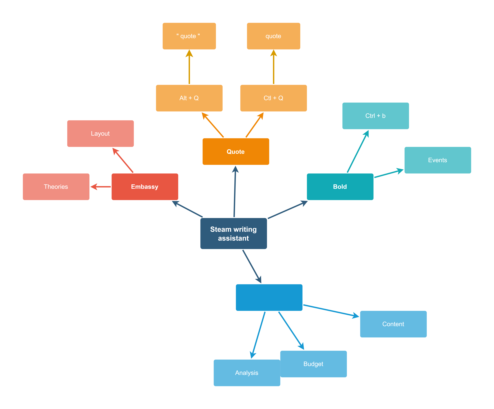

# Steam writing assistant (SWA)

a **Software** to make writing in Steam forums more organized and fun
<p align="left" width="100%">
    <br>.
     
</p>


# Futures


- Auto Bold, Quote

<p align="left" width="100%">
    <br>.
      
</p>


# 	How to use 


# Hotkeys:

- `Ctrl + Q`  to do quotes. 
- `Ctrl + B` converts to Bold fonts.
- `Ctrl + I` converts to italic fonts.
- `Shift + Ctrl + I` & `Shift + Ctrl + B`  Bold + italic 
- `ctrl +S`  spoilers.
- `Ctrl + H`  insert a horizontal line.
- `ctrl + 3` Bulleted list.
- `ctrl + 2` order list.
- `ctrl + 1` one slot list
- `Alt + c`   code
- `Signature` F1  and  F5 to  refresh it 


# Debug menu

For devs or Expert users

`F4` God mode in the `Message box`





  ````mermaid

  mindmap
  root((Steam writing assistant))
  	Quote
  		Ctrl+Q	
  		Alt+Q
  	Bold
  		Ctrl+B
  		Alt+b
  	Italic
  		Ctrl+I
  		Alt+I
  	Spoilers
  		Ctrl+S
  	Horizontal line
  		Ctrrl+H
  	Bulleted list
  		Ctrl+3
  			One more slot list
  				Ctrl+1
  	Order list
  		Ctrl+4
  			One more slot list
  				Ctrl+1
  	Code
  		Alt+c
  		Ctrl+e
  	
  	
  
  ````


# Art History


# HTML test

```html
	<section>
		<div class="main-topic">
			<div class="left-text">
				<h3>Deadpool Fans Petition 'SNL' for Superhero to Host</h3>
				<p>
					Deadpool fans want its superhero to host Saturday Night Live — Deadpool, that is, not Ryan Reynolds. Fans of the Merc With a Mouth, who led the Marvel film to a history-making debut at the box office, have launched a Change.org petition calling for the antihero to host an upcoming episode of the NBC sketch comedy show. "We've all seen the trailers, the magazine covers, the viral videos, and the billboards by now, so what's left for Deadpool (Ryan Reynolds) to do?" creator Andrew Stege asks in the petition, which is directed to SNL, creator Lorne Michaels, parent.
				</p>
			</div>
			<div class="right-picture">
				
			</div>
			<div class="clear"></div>
		<div>
	</se
```


s

