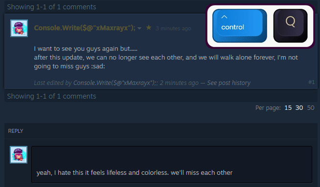
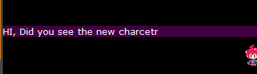
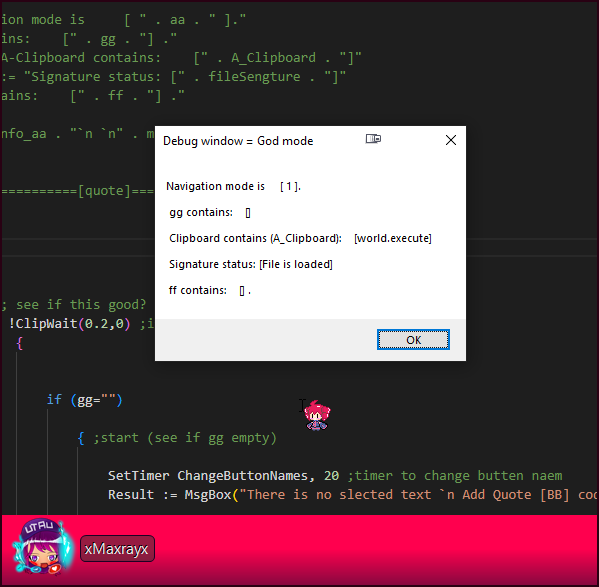

# Steam writing assistant (SWA)

a **Software** that makes writing in Steam forums more organized and fun

# Futures:

- Auto Quote

     
    .  

  

- Auto Bold, Italic 

     
      

* Customizable **Signature**

  

* Auto lower-case F10

  

* Auto-Translate to English (not yet)

# Hotkeys (new)

- **Q**uote `Ctrl + Q` or `Alt + Q` for "Quote".

- **B**old  `Ctrl + B` or `Alt + B` for "Bold".

- **I**talic  `Ctrl + I` or `Alt + I` for "quote".

- **S**poilers `Ctrl + S` or `Alt + S` for "quote".

- **H**orizontal line. `Ctrl + H`.

- Bulleted list (● ● ●)  `Ctrl+3`

- Order List (-1 -2 -3) `Ctrl+4`

- One more slot list +**1** `Ctrl + 1`

- **C**od**e** `ALT+ C`  or `Ctrl  + E`

- **S**ignature `F1` and `F5` to refresh new signature `Shift+F5` to change the signature.

  

# Debug menu

For devs or Expert users

- `God mode`:  press `F4`  to show God mode in the `Message box`

# Change log:

## v2.0.0 (Engine Upgrade):

- #### New Engine: Based on `AHKv2`

  completely re-written from ground to upgrade from `AHKv1` to `AHKv2`

  

- #### New Futures:

  - Smart navigation v1.
  - Smart Bold, Quote ,italic.
  - Auto Double { } " " [ ]
  - Signature.
  - Auto-correct.
  - Auto-rewrite game names.

## v1.0.0 (First release):

- based on `AHKv1`.

# For development section

# Bugs 													

- [x] change function Ctrl+Q to not paste it.

- [x] Fix Bolds with a mouse selection.

- [x] Fix the signature to support UTF-16

- [ ] fix no space removed "StrReplace"

- [ ] disable remove space with mouse selection.

- [ ] fix the `smartNavigation` number in f4 debug mode? (bc integer =/= string ????)

- [x] Fix F10 not working

  

  

# Bugs outside the control (need to rework)

# Changes

- [x] change debug window to all-in-**ONE** window.
- [x] change the "gg" variable to easy to better name. ("gg" to "modClipbord_God")
- [x] change the "ff" variable to easy to better name. ("ff" to "modClipbord_Backup")
- [ ] change for "aa" variable (--> )
- [ ] add `modClipbord_Backup_for_devs` for debug menu
- [ ] change ctrl+q from cut to copy

# Planned New Futures											

- [ ] add checkboxes for more options to print in `ini .file`

- [x] Smarter quote.
- [ ] translator

# Idea 

- [ ] random signature
- [ ]  more  slot of signature
- [ ]  auto-censor
- [ ]  replace-censor

------

@xmaxray 									@unbreakable-ray

Auto-merged at 06:29:11 PM 2023/06/24	@xMaxrayx	@Unbreakable-ray

All-in-one Readme Lite : https://github.com/Unbreakable-ray/All-in-one-Readme_Lite
