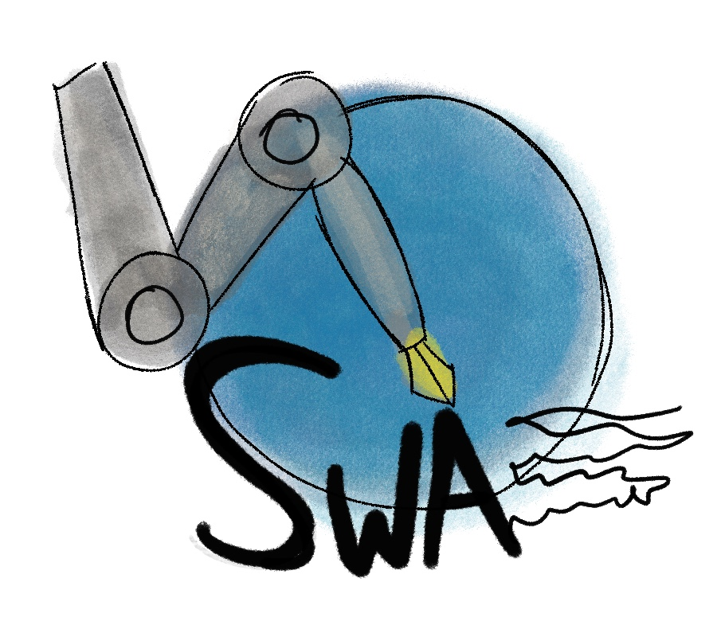

# Steam writing assistant (SWA)

a **Software** to make writing in Steam forums more organized and fun
<p align="left" width="100%">
    <br>.
     
</p>


# Futures


- Auto Bold, Quote

<p align="left" width="100%">
    <br>.
      
</p>


# How to use 


# Hotkeys:

- `Ctrl + Q`  to do quotes. 
- `Ctrl + B` converts to Bold fonts.
- `Ctrl + I` converts to italic fonts.
- `Shift + Ctrl + I` & `Shift + Ctrl + B`  Bold + italic 
- `ctrl +S`  spoilers.
- `Ctrl + H`  insert a horizontal line.
- `ctrl + 3` Bulleted list.
- `ctrl + 2` order list.
- `ctrl + 1` one slot list
- `Alt + c`   code
- `Signature` F1  and  F5 to  refresh it 


# Debug menu

For devs or Expert users

`F4` God mode in the `Message box`


  ````mermaid

  mindmap
  root((Steam writing assistant))
  	Quote
  		Ctrl+Q	
  		Alt+Q
  	Bold
  		Ctrl+B
  		Alt+b
  	Italic
  		Ctrl+I
  		Alt+I
  	Spoilers
  		Ctrl+S
  	Horizontal line
  		Ctrrl+H
  	Bulleted list
  		Ctrl+3
  			One more slot list
  				Ctrl+1
  	Order list
  		Ctrl+4
  			One more slot list
  				Ctrl+1
  	Code
  		Alt+c
  		Ctrl+e
  	
  	
  
  ````


# Art History


