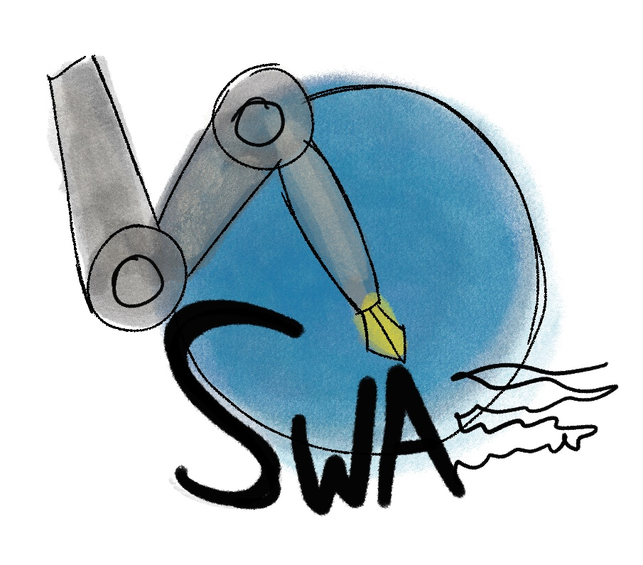
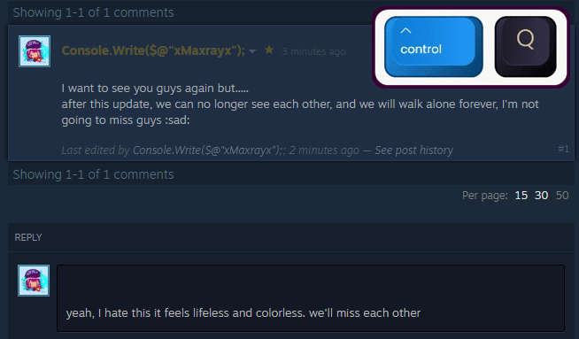
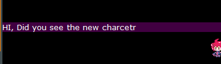
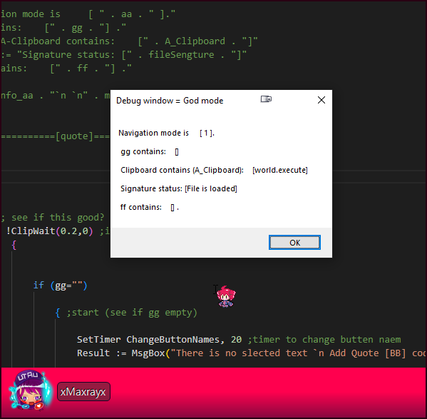

# Steam writing assistant (SWA)

a **Software** that makes writing in Steam forums more organized and fun

# Futures:

- Auto Quote

     
    .  

  

- Auto Bold, Italic 

     
      

* Customizable **Signature**

  

* Auto lower-case F10

  

* Auto-Translate to English (not yet)

# Hotkeys (new)

- **Q**uote `Ctrl + Q` or `Alt + Q` for "Quote".

- **B**old  `Ctrl + B` or `Alt + B` for "Bold".

- **I**talic  `Ctrl + I` or `Alt + I` for "quote".

- **S**poilers `Ctrl + S` or `Alt + S` for "quote".

- **H**orizontal line. `Ctrl + H`.

- Bulleted list (● ● ●)  `Ctrl+3`

- Order List (-1 -2 -3) `Ctrl+4`

- One more slot list +**1** `Ctrl + 1`

- **C**od**e** `ALT+ C`  or `Ctrl  + E`

- **S**ignature `F1` and `F5` to refresh new signature `Shift+F5` to change the signature.

  

# Debug menu

For devs or Expert users

- `God mode`:  press `F4`  to show God mode in the `Message box`

